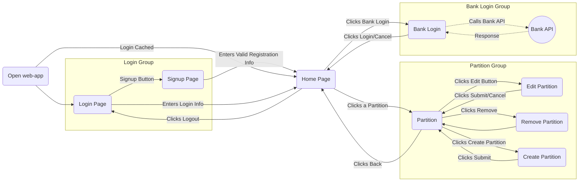
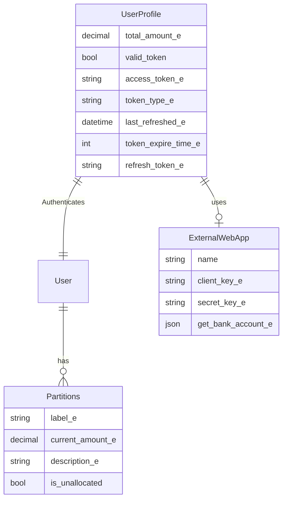

- - - 
## Web App Flow

```mermaid
flowchart LR
id1(Open web-app) --> id3(Login Page)
subgraph Login Group
id3(Login Page) -- Signup Button --> id4(Signup Page)
end
id4(Signup Page) -- Enters Valid Registration Info --> id2
id1(Open web-app) -- Login Cached --> id2(Home Page)
id2 -- Clicks Logout --> id3
id3 -- Enters Login Info --> id2

id2 -- Clicks a Partition --> id5(Partition)
id5 -- Clicks Back --> id2
subgraph Partition Group
id5 -- Clicks Edit Button --> id6(Edit Partition)
id6 -- Clicks Submit/Cancel --> id5
id5 -- Clicks Remove --> id7(Remove Partition)
id7 --> id5
id5 -- Clicks Create Partition --> id8(Create Partition)
id8 -- Clicks Submit --> id5
end
id2 -- Clicks Bank Login --> id9(Bank Login)
id9 -- Clicks Login/Cancel --> id2
subgraph Bank Login Group
id9 -. Calls Bank API .-> id10(( Bank API ))
id10 -. Response .-> id9
end
```

---
## Entity Relation Diagram

```mermaid
erDiagram
UserProfile ||--|| User : Authenticates
UserProfile {
	decimal total_amount_e
	bool valid_token
	string access_token_e
	string token_type_e
	datetime last_refreshed_e
	int token_expire_time_e
	string refresh_token_e
}
UserProfile ||--o| ExternalWebApp : uses
ExternalWebApp {
	string name
	string client_key_e
	string secret_key_e
	json get_bank_account_e
}
User ||--o{ Partitions : has
Partitions {
	string label_e
	decimal current_amount_e
	string description_e
	bool is_unallocated
}
```
